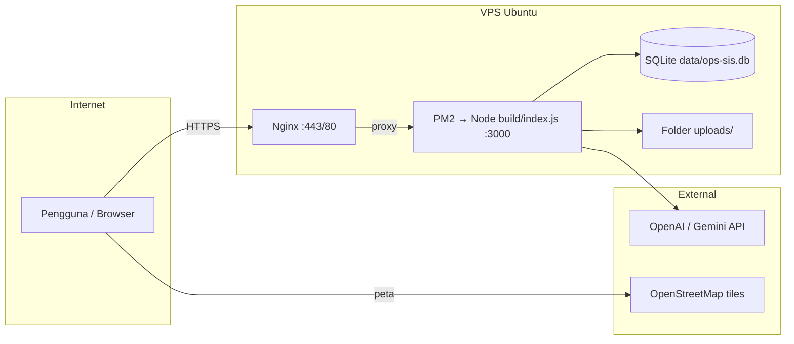

# Panduan Deploy OPS-SIS — Lengkap

Dokumen ini menjelaskan cara men-deploy **OPS-SIS** ke VPS **Ubuntu 22.04 / 24.04** dari nol hingga production, termasuk troubleshooting, backup, update, dan keamanan.

> **Stack production saat ini:** Node.js 22 + SvelteKit (`adapter-node`) + **SQLite** (file) + Nginx + PM2. Bukan XAMPP/Apache/PHP.

---

## Daftar isi

1. [Ringkasan arsitektur deploy](#1-ringkasan-arsitektur-deploy)
2. [Prasyarat](#2-prasyarat)
3. [Instalasi otomatis (`install.sh`)](#3-instalasi-otomatis-installsh)
4. [Instalasi manual langkah demi langkah](#4-instalasi-manual-langkah-demi-langkah)
5. [Variabel lingkungan](#5-variabel-lingkungan)
6. [Nginx & HTTPS](#6-nginx--https)
7. [PM2 & proses Node](#7-pm2--proses-node)
8. [Database & seed](#8-database--seed)
9. [Upload & backup](#9-upload--backup)
10. [Update / redeploy](#10-update--redeploy)
11. [Monitoring & health check](#11-monitoring--health-check)
12. [Keamanan production](#12-keamanan-production)
13. [Troubleshooting](#13-troubleshooting)
14. [Checklist go-live](#14-checklist-go-live)

---

## 1. Ringkasan arsitektur deploy



| Komponen | Peran |
|----------|--------|
| **Nginx** | TLS termination, reverse proxy, timeout panjang untuk SSE |
| **PM2** | Menjaga proses Node hidup, restart otomatis |
| **SvelteKit build** | `build/index.js` — server HTTP production |
| **SQLite** | Satu file DB di `data/ops-sis.db` |
| **uploads/** | Foto LHP, Rengiat, insiden Live Wall |

**Penting:** SSE (notifikasi real-time) memakai broadcaster **in-memory**. Jalankan **satu instance** PM2 (`instances: 1`). Jangan PM2 cluster tanpa pub/sub (Redis).

---

## 2. Prasyarat

### Server

| Item | Rekomendasi minimum |
|------|---------------------|
| OS | Ubuntu 22.04 LTS atau 24.04 LTS |
| RAM | 1 GB (2 GB lebih nyaman dengan build) |
| CPU | 1 vCPU |
| Disk | 20 GB+ (tergantung volume foto) |
| Akses | SSH + sudo |

### DNS & jaringan

- Record **A** (atau AAAA) domain → IP publik VPS.
- Port **80** dan **443** terbuka ke internet (untuk Let's Encrypt).
- Port **3000** **tidak** perlu dibuka publik (hanya localhost di belakang Nginx).

### Repositori

- Kode di GitHub/GitLab, **atau** salin repo ke server (`--from-local`).

---

## 3. Instalasi otomatis (`install.sh`)

### 3.1 Persiapan

```bash
# Di laptop: push kode ke git, atau scp repo ke server

# Di server (login SSH):
sudo apt-get update && sudo apt-get install -y git
git clone https://github.com/ORGANISASI/ops-sis.git
cd ops-sis
chmod +x deploy/install.sh
```

### 3.2 Mode interaktif

```bash
sudo bash deploy/install.sh
# Akan diminta: domain publik
```

### 3.3 Mode non-interaktif (disarankan)

```bash
sudo DOMAIN=sis.example.com \
     EMAIL=admin@example.com \
     APP_DIR=/var/www/ops-sis \
     APP_USER=ops-sis \
     bash deploy/install.sh --yes
```

### 3.4 Deploy dari folder repo tanpa git di server

```bash
# Setelah upload/rsync repo ke server:
cd /path/to/ops-sis
sudo DOMAIN=sis.example.com EMAIL=you@example.com \
     bash deploy/install.sh --from-local --yes
```

### 3.5 Opsi skrip

| Flag / env | Keterangan |
|------------|------------|
| `--yes` | Non-interaktif; wajib `DOMAIN=...` |
| `--from-local` | Rsync dari repo saat ini ke `APP_DIR` |
| `--skip-seed` | Tidak menjalankan `npm run db:seed` |
| `--skip-nginx` | Lewati Nginx |
| `--skip-ssl` | Lewati Certbot |
| `INSTALL_FROM_GIT=url` | Clone/pull dari remote |
| `GIT_BRANCH=main` | Branch deploy |
| `NODE_MAJOR=22` | Versi Node dari NodeSource |
| `PORT=3000` | Port internal Node |

### 3.6 Apa yang dilakukan skrip?

1. Memasang: `build-essential`, `nginx`, `git`, `certbot`, `ufw`, dll.
2. Memasang Node.js 22.x (NodeSource) dan PM2 global.
3. Membuat user sistem `ops-sis` (default).
4. Menyalin/clone aplikasi ke `/var/www/ops-sis`.
5. Membuat `.env.production` dari domain.
6. `npm ci` → `db:seed` (opsional) → `npm run build`.
7. `pm2 start deploy/ecosystem.config.cjs`.
8. Konfigurasi Nginx + Certbot (jika `EMAIL` di-set).
9. UFW: izinkan SSH + Nginx.

---

## 4. Instalasi manual langkah demi langkah

Gunakan jika skrip otomatis tidak cocok (policy IT, custom path, dll).

### 4.1 Paket sistem

```bash
sudo apt-get update
sudo apt-get install -y build-essential python3 git nginx curl rsync
curl -fsSL https://deb.nodesource.com/setup_22.x | sudo -E bash -
sudo apt-get install -y nodejs
sudo npm install -g pm2
```

### 4.2 User & direktori

```bash
sudo useradd --system --home-dir /var/www/ops-sis --create-home ops-sis || true
sudo mkdir -p /var/www/ops-sis
sudo chown ops-sis:ops-sis /var/www/ops-sis
```

### 4.3 Kode aplikasi

```bash
sudo -u ops-sis git clone https://github.com/ORG/ops-sis.git /var/www/ops-sis
cd /var/www/ops-sis
```

### 4.4 Environment

```bash
sudo -u ops-sis cp .env.production.example .env.production
sudo -u ops-sis nano .env.production
```

Isi minimal:

```env
NODE_ENV=production
ORIGIN=https://sis.example.com
VITE_APP_URL=https://sis.example.com
HOST=127.0.0.1
PORT=3000
DATABASE_URL=file:./data/ops-sis.db
UPLOAD_DIR=./uploads
```

### 4.5 Build

```bash
sudo -u ops-sis bash -lc 'cd /var/www/ops-sis && npm ci'
sudo -u ops-sis bash -lc 'cd /var/www/ops-sis && npm run db:seed'   # pertama kali
sudo -u ops-sis bash -lc 'cd /var/www/ops-sis && set -a && source .env.production && set +a && npm run build'
```

### 4.6 PM2

```bash
sudo -u ops-sis bash -lc 'cd /var/www/ops-sis && pm2 start deploy/ecosystem.config.cjs'
sudo -u ops-sis pm2 save
sudo env PATH=$PATH:/usr/bin pm2 startup systemd -u ops-sis --hp /var/www/ops-sis
```

Edit `deploy/ecosystem.config.cjs` — sesuaikan `ORIGIN`, `VITE_APP_URL`, `DATABASE_URL`.

### 4.7 Nginx

```bash
sudo cp deploy/nginx-ops-sis.conf.example /etc/nginx/sites-available/ops-sis
# Ganti sis.example.com → domain Anda
sudo nano /etc/nginx/sites-available/ops-sis
sudo ln -s /etc/nginx/sites-available/ops-sis /etc/nginx/sites-enabled/
sudo rm -f /etc/nginx/sites-enabled/default
sudo nginx -t && sudo systemctl reload nginx
```

### 4.8 HTTPS (Let's Encrypt)

```bash
sudo certbot --nginx -d sis.example.com --email admin@example.com --agree-tos
```

---

## 5. Variabel lingkungan

| Variabel | Wajib prod? | Keterangan |
|----------|-------------|------------|
| `NODE_ENV` | Ya | `production` |
| `ORIGIN` | Ya | URL publik penuh; dipakai adapter-node |
| `VITE_APP_URL` | Ya | Sama dengan ORIGIN; CSRF build + runtime |
| `HOST` | Disarankan | `127.0.0.1` di belakang Nginx |
| `PORT` | Disarankan | `3000` (default) |
| `DATABASE_URL` | Ya | `file:./data/ops-sis.db` |
| `UPLOAD_DIR` | Ya | `./uploads` |
| `AI_PROVIDER` | Opsional | `openai` atau `gemini` |
| `OPENAI_API_KEY` | Opsional | Untuk AI auditor/generator |
| `GEMINI_API_KEY` | Opsional | Alternatif Gemini |

**Build vs runtime:** `VITE_APP_URL` harus benar **sebelum** `npm run build`, karena nilai CSRF `trustedOrigins` di-bake saat build.

Setelah mengubah `.env.production`:

```bash
cd /var/www/ops-sis
sudo -u ops-sis bash -lc 'set -a && source .env.production && set +a && npm run build'
sudo -u ops-sis pm2 restart ops-sis
```

---

## 6. Nginx & HTTPS

File contoh: `deploy/nginx-ops-sis.conf.example`.

### SSE (`/api/events`)

Wajib:

- `proxy_buffering off`
- `proxy_read_timeout` besar (86400s)
- Jangan cache endpoint SSE

Tanpa ini, notifikasi real-time bisa tertunda atau putus.

### Ukuran upload

`client_max_body_size 25M` — sesuaikan jika foto besar.

### Header proxy

Pastikan `X-Forwarded-Proto $scheme` agar cookie `secure` dan URL benar di belakang HTTPS.

---

## 7. PM2 & proses Node

```bash
sudo -u ops-sis pm2 status
sudo -u ops-sis pm2 logs ops-sis --lines 100
sudo -u ops-sis pm2 restart ops-sis
```

| Perintah | Fungsi |
|----------|--------|
| `pm2 monit` | CPU/RAM live |
| `pm2 reload ops-sis` | Zero-downtime (tetap 1 instance) |

Log aplikasi juga ke stdout PM2 (`~/.pm2/logs/`).

---

## 8. Database & seed

- File: `{APP_DIR}/data/ops-sis.db`
- Seed demo: `npm run db:seed` — membuat unit POLDA Metro Jaya + user demo (lihat `demo-credentials.md`).

**Production:**

1. Set `SKIP_SEED=1` pada instalasi, **atau**
2. Seed lalu **segera ganti password** / buat user baru lewat admin POLDA.
3. Jangan commit `data/*.db` ke git.

Migrasi schema: otomatis saat app start via `src/lib/server/db/migrate.ts`.

---

## 9. Upload & backup

### Struktur upload

```
uploads/
  general/
  laporan/
  rengiat/
  ...
```

File dilayani lewat `/api/uploads/...` dengan validasi path traversal.

### Backup harian (contoh cron)

```bash
# /etc/cron.daily/ops-sis-backup
#!/bin/bash
STAMP=$(date +%Y%m%d)
tar -czf /backup/ops-sis-${STAMP}.tar.gz \
  /var/www/ops-sis/data \
  /var/www/ops-sis/uploads \
  /var/www/ops-sis/.env.production
```

Restore: stop PM2 → ekstrak → `chown ops-sis:ops-sis` → start PM2.

---

## 10. Update / redeploy

```bash
cd /var/www/ops-sis
sudo -u ops-sis git pull
sudo -u ops-sis npm ci
sudo -u ops-sis bash -lc 'set -a && source .env.production && set +a && npm run build'
sudo -u ops-sis pm2 restart ops-sis
```

Dengan skrip (from-local dari mesin build):

```bash
sudo DOMAIN=sis.example.com bash deploy/install.sh --from-local --yes --skip-seed
```

---

## 11. Monitoring & health check

```bash
curl -s https://sis.example.com/api/health | jq
```

Respons contoh:

```json
{ "ok": true, "telemetry": { "sse_connected": 0, ... } }
```

Pantau juga: `pm2 status`, `df -h`, ukuran `uploads/`, log Nginx `/var/log/nginx/error.log`.

---

## 12. Keamanan production

| Area | Praktik |
|------|---------|
| HTTPS | Wajib (cookie session `secure` di production) |
| Firewall | UFW: hanya 22, 80, 443 |
| Password | Ganti semua akun demo |
| `.env.production` | chmod 600, hanya user `ops-sis` |
| SSH | Key-based auth, nonaktifkan root login |
| Update OS | `unattended-upgrades` |
| AI keys | Jangan commit; rotate jika bocor |

CSRF: `trustedOrigins` + pengecekan `Origin` di `hooks.server.ts`.

---

## 13. Troubleshooting

### Login gagal 403 / Cross-site

- Pastikan URL browser **sama persis** dengan `VITE_APP_URL` / `ORIGIN` (termasuk `https`).
- Rebuild setelah ubah `VITE_APP_URL`.

### Login gagal 401

- DB belum di-seed: `npm run db:seed`
- Username/password salah (lihat demo hanya untuk dev)

### Halaman putih / 502 Bad Gateway

```bash
sudo -u ops-sis pm2 logs ops-sis
curl -I http://127.0.0.1:3000/api/health
```

- PM2 tidak jalan → `pm2 start`
- Build belum ada → `npm run build`

### `better_sqlite3` MODULE_VERSION mismatch

Node versi berbeda saat install vs run:

```bash
cd /var/www/ops-sis
sudo -u ops-sis rm -rf node_modules
sudo -u ops-sis npm ci
sudo -u ops-sis npm run build
```

### SSE tidak real-time

- Nginx buffering (perbaiki blok `/api/events`)
- Beberapa tab/instance PM2 > 1

### Certbot gagal

- DNS belum mengarah ke VPS
- Port 80 diblokir firewall

### Upload ditolak

- Ekstensi tidak diizinkan (jpg, png, pdf, docx, xlsx)
- File corrupt / bukan magic number valid

---

## 14. Checklist go-live

- [ ] Domain & DNS aktif
- [ ] HTTPS aktif (Certbot)
- [ ] `.env.production` lengkap & rebuild
- [ ] PM2 `online`, health OK
- [ ] Password demo diganti / user prod dibuat
- [ ] Backup cron terpasang
- [ ] AI API key (jika fitur AI dipakai)
- [ ] Uji login tiap peran: POLSEK, POLRES, POLDA, KARO OPS
- [ ] Uji SSE: approve Rengiat → notifikasi di dashboard lain
- [ ] Uji upload LHP dari mobile (LAN/internet)

---

**Dokumen terkait:** [PROJECT-DOCUMENTATION.md](./PROJECT-DOCUMENTATION.md) · [README.md](../README.md)
