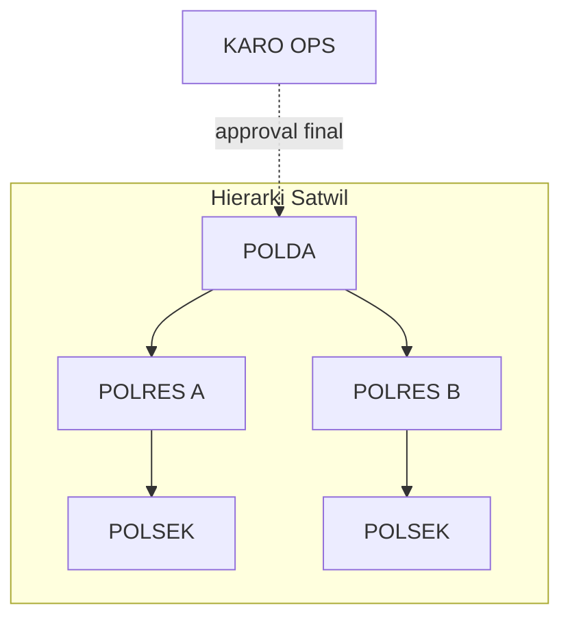
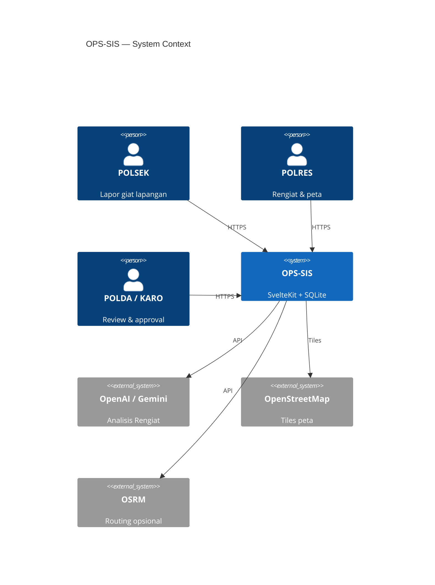
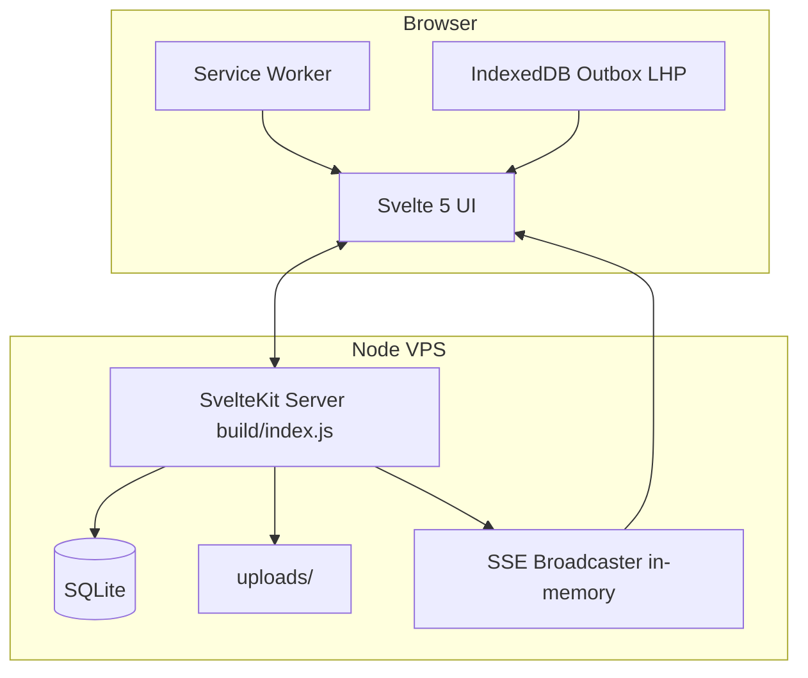
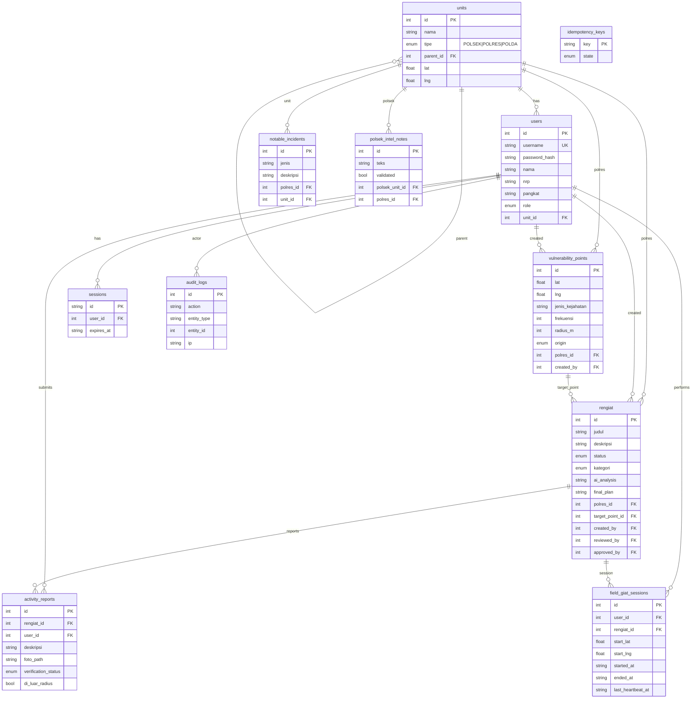
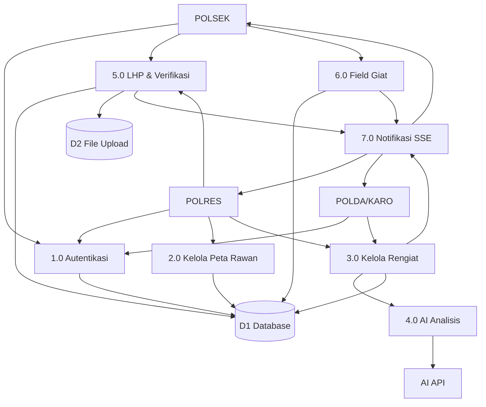
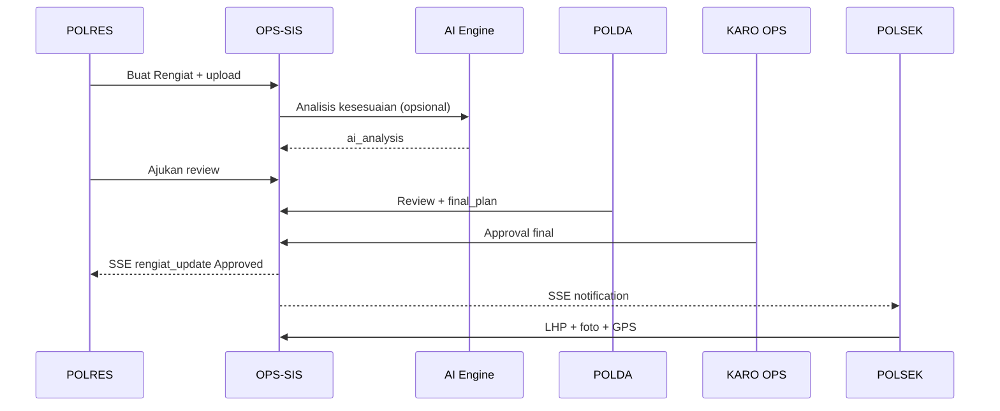
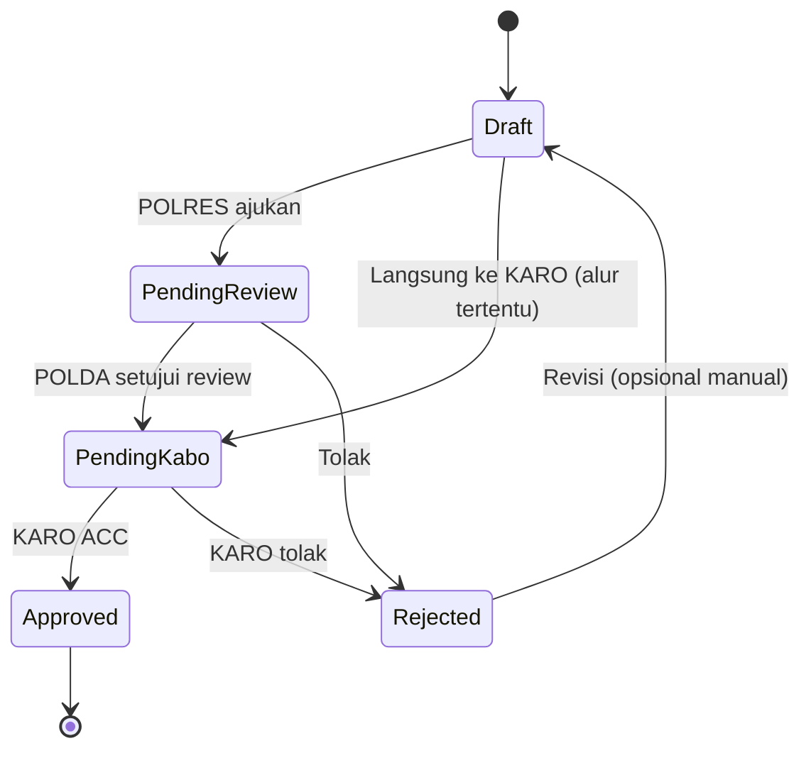
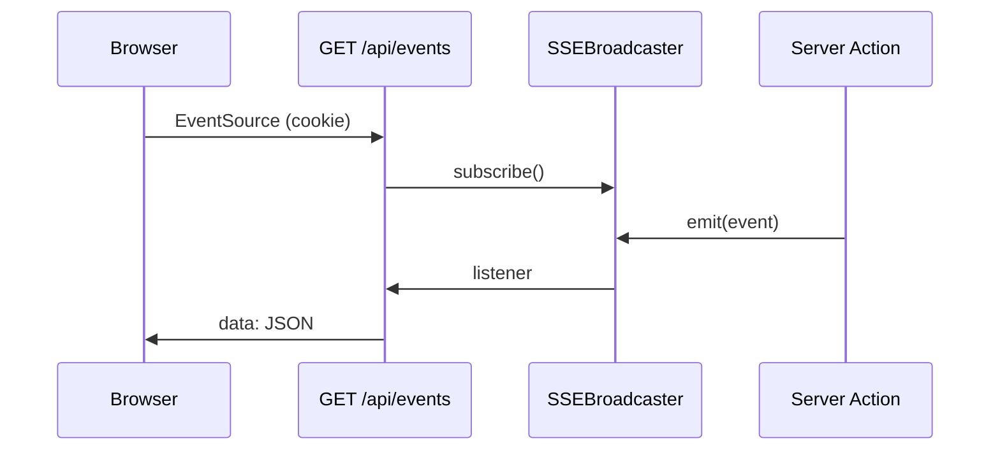

# Dokumentasi Proyek OPS-SIS — Lengkap

**OPS-SIS** (*Sistem Informasi Operasi*) adalah platform web full-stack untuk digitalisasi **peta kerawanan**, **Rencana Kegiatan (Rengiat)**, **Laporan Hasil Pelaksanaan (LHP)**, **monitoring giat lapangan**, dan **Live Wall** di lingkungan kepolisian (POLSEK → POLRES → POLDA → KARO OPS).

Dokumen ini ditujukan untuk **developer baru**, **auditor teknis**, dan **tim operasional** yang melanjutkan pengembangan.

| Dokumen | Isi |
|---------|-----|
| [Master-PRD.md](../Master-PRD.md) | Product requirements awal |
| [DEPLOYMENT.md](./DEPLOYMENT.md) | Deploy VPS Ubuntu |
| [demo-credentials.md](../demo-credentials.md) | Akun demo (dev saja) |
| [README.md](../README.md) | Quick start developer |

---

## Daftar isi

1. [Visi & ruang lingkup](#1-visi--ruang-lingkup)
2. [Stakeholder & peran (RBAC)](#2-stakeholder--peran-rbac)
3. [Glosarium](#3-glosarium)
4. [Arsitektur sistem](#4-arsitektur-sistem)
5. [Stack teknologi (implementasi aktual)](#5-stack-teknologi-implementasi-aktual)
6. [Struktur direktori](#6-struktur-direktori)
7. [ERD — Entity Relationship Diagram](#7-erd--entity-relationship-diagram)
8. [DFD — Data Flow Diagram](#8-dfd--data-flow-diagram)
9. [Alur bisnis utama](#9-alur-bisnis-utama)
10. [Mesin status (state machine)](#10-mesin-status-state-machine)
11. [API & endpoint](#11-api--endpoint)
12. [Autentikasi & keamanan](#12-autentikasi--keamanan)
13. [Real-time (SSE)](#13-real-time-sse)
14. [Integrasi AI](#14-integrasi-ai)
15. [Peta & geolokasi](#15-peta--geolokasi)
16. [Offline & PWA (LHP)](#16-offline--pwa-lhp)
17. [UI & design system](#17-ui--design-system)
18. [Panduan pengembangan lokal](#18-panduan-pengembangan-lokal)
19. [Testing](#19-testing)
20. [Roadmap & gap terhadap PRD](#20-roadmap--gap-terhadap-prd)
21. [Konvensi kode](#21-konvensi-kode)

---

## 1. Visi & ruang lingkup

### 1.1 Masalah yang diselesaikan

- Koordinasi Rengiat antar tingkat masih lambat tanpa sistem terpusat.
- Titik kerawanan sulit divisualisasikan tanpa peta digital.
- Laporan giat lapangan perlu bukti foto + validasi lokasi.
- Pimpinan membutuhkan monitoring real-time personil di lapangan.

### 1.2 Ruang lingkup in-scope

| Modul | Deskripsi singkat |
|-------|-------------------|
| Peta kerawanan | CRUD titik rawan (POLRES/POLSEK/POLDA scope) |
| Rengiat | Buat, review, AI, approval KARO OPS |
| LHP | Laporan kegiatan POLSEK + geo-fence |
| Verifikasi LHP | POLRES/Kabag setujui atau kembalikan |
| Field Giat | Check-in lapangan + heartbeat |
| Monitoring | Dashboard personil giat (POLRES/POLDA) |
| Live Wall | Insiden menonjol + feed |
| Admin Satwil | Manajemen unit (POLDA only) |
| Export ANEV | Ekspor Excel agregat |

### 1.3 Out of scope (saat ini)

- MySQL production (PRD menyebut; implementasi **SQLite**)
- Object storage S3 (env ada; kode **local disk**)
- Push notification mobile native (hanya SSE web)
- SSO/LDAP integrasi

---

## 2. Stakeholder & peran (RBAC)



| Peran kode | Nama bisnis | Unit terikat | Hak utama |
|------------|-------------|--------------|-----------|
| `POLSEK` | Personil POLSEK | POLSEK | LHP, field giat, intel note, titik rawan (origin polsek) |
| `POLRES` | Admin / ops POLRES | POLRES | Peta, Rengiat, verifikasi LHP, monitoring wilayah |
| `POLDA` | Admin Polda | POLDA | Review Rengiat, AI generator, admin satwil, monitoring semua POLRES |
| `KARO OPS` | Kepala/Karo Ops | POLDA (biasanya) | Approval final Rengiat, monitoring nasional/wilayah |

**Scoping data:** helper `polda-scope.ts` memastikan POLRES/POLSEK hanya mengakses data di bawah POLDA induknya.

**Layout guard contoh:**

- `/dashboard/admin/*` → hanya `POLDA` (`admin/+layout.server.ts`)
- Live Wall → role tertentu (`live-wall/+layout.server.ts`)

---

## 3. Glosarium

| Istilah | Arti |
|---------|------|
| **Rengiat** | Rencana Kegiatan operasional |
| **LHP** | Laporan Hasil Pelaksanaan kegiatan |
| **Titik rawan** | `vulnerability_points` — koordinat + jenis kejahatan |
| **Zona merah** | Kategori Rengiat penanganan area rawan |
| **Field Giat** | Sesi personil sedang tugas di lapangan |
| **SSE** | Server-Sent Events — push notifikasi ke browser |
| **Satwil** | Satuan wilayah: POLSEK / POLRES / POLDA |
| **Geo-fence** | Validasi GPS LHP dalam radius (default 200 m dari acuan) |
| **ANEV** | Analisis evaluasi — ekspor agregat Excel |

---

## 4. Arsitektur sistem

### 4.1 C4 — Context (Level 1)



### 4.2 Container (Level 2)



### 4.3 Komponen server utama

| Modul file | Tanggung jawab |
|------------|----------------|
| `auth.ts` | Login, session cookie, RBAC helper |
| `db/schema.ts` | Drizzle ORM schema |
| `db/migrate.ts` | Migrasi SQL incremental |
| `activity-report.ts` | Bisnis LHP + verifikasi |
| `field-giat.ts` | Start/end/heartbeat giat |
| `ai.ts` | OpenAI / Gemini |
| `storage.ts` | Simpan file upload |
| `sse.ts` | Broadcast event |
| `polda-scope.ts` | Filter wilayah POLDA |

---

## 5. Stack teknologi (implementasi aktual)

| Lapisan | Teknologi | Catatan |
|---------|-----------|---------|
| Framework | SvelteKit 2 + Svelte 5 | Full-stack |
| Runtime | Node.js 22+ | Volta pin di `package.json` |
| Deploy adapter | `@sveltejs/adapter-node` | Output `build/index.js` |
| DB | SQLite + `better-sqlite3` | File `data/ops-sis.db` |
| ORM | Drizzle ORM | Schema sqlite-core |
| Auth | Cookie session + bcrypt | 7 hari TTL |
| CSS | Tailwind CSS 4 | + tokens di `lib/styles/` |
| Peta | Leaflet + OSM tiles | Marker cluster |
| AI | OpenAI GPT-4o-mini / Gemini 1.5 Flash | Via env |
| Process mgr | PM2 (production) | 1 instance |
| Proxy | Nginx | TLS + SSE |

**Perbedaan vs Master-PRD:** PRD menyebut MySQL; kode production saat ini SQLite (lihat [§20](#20-roadmap--gap-terhadap-prd)).

---

## 6. Struktur direktori

```
ops-sis/
├── src/
│   ├── routes/              # SvelteKit routes (pages + API)
│   │   ├── api/             # REST/SSE endpoints
│   │   ├── dashboard/       # App utama setelah login
│   │   ├── login/
│   │   └── live-wall/
│   ├── lib/
│   │   ├── server/          # Kode hanya server-side
│   │   ├── client/          # Browser helpers (compress, outbox)
│   │   ├── components/      # UI components
│   │   ├── stores/          # Svelte stores (notifikasi, feed)
│   │   └── geo/             # Geo-fence logic
│   ├── hooks.server.ts      # Session + CSRF origin guard
│   └── service-worker.ts    # PWA cache
├── static/                  # Asset statis
├── data/                    # SQLite (gitignored)
├── uploads/                 # Media (gitignored)
├── deploy/
│   ├── install.sh           # Installer Ubuntu
│   ├── ecosystem.config.cjs # PM2
│   └── nginx-ops-sis.conf.example
├── docs/
│   ├── DEPLOYMENT.md
│   └── PROJECT-DOCUMENTATION.md  # dokumen ini
├── drizzle.config.ts
├── svelte.config.js
└── package.json
```

### 6.1 Peta route halaman

| Path | Peran tipikal | Fungsi |
|------|---------------|--------|
| `/` | Publik | Landing |
| `/login` | Publik | Autentikasi |
| `/dashboard` | Semua | Home / ringkasan |
| `/dashboard/peta` | POLRES, POLDA | Peta kerawanan |
| `/dashboard/rengiat` | POLRES, POLDA, KARO | Daftar Rengiat |
| `/dashboard/rengiat/baru` | POLRES | Buat Rengiat |
| `/dashboard/rengiat/[id]` | POLRES, POLDA, KARO | Detail & workflow |
| `/dashboard/laporan` | POLSEK | Buat LHP |
| `/dashboard/verifikasi-lhp` | POLRES | Verifikasi massal LHP |
| `/dashboard/giat-saya` | POLSEK | Field giat |
| `/dashboard/monitoring` | POLRES, POLDA, KARO | Monitoring giat |
| `/dashboard/admin/satwil` | POLDA | CRUD unit |
| `/live-wall` | Tertentu | Wall insiden |

---

## 7. ERD — Entity Relationship Diagram



### 7.1 Tabel ringkasan

| Tabel | PK | Relasi utama |
|-------|-----|--------------|
| `units` | `id` | Hierarki `parent_id` → POLDA→POLRES→POLSEK |
| `users` | `id` | `unit_id` → units |
| `sessions` | `id` (UUID) | `user_id` |
| `vulnerability_points` | `id` | `polres_id`, optional `polsek_unit_id` |
| `rengiat` | `id` | `polres_id`, `target_point_id`, status workflow |
| `activity_reports` | `id` | `rengiat_id`, `user_id`, verifikasi |
| `field_giat_sessions` | `id` | Giat aktif per user+rengiat |
| `notable_incidents` | `id` | Live Wall |
| `polsek_intel_notes` | `id` | Intel tekstual POLSEK |
| `audit_logs` | `id` | Audit trail |
| `idempotency_keys` | `key` | Sync offline LHP |

---

## 8. DFD — Data Flow Diagram

### 8.1 Level 0 (Context)

```mermaid
flowchart LR
  E1[POLSEK]
  E2[POLRES]
  E3[POLDA / KARO]
  P0[(0) OPS-SIS]
  DS[(SQLite + uploads)]
  AI[AI Provider]

  E1 <-->|LHP Giat| P0
  E2 <-->|Rengiat Peta| P0
  E3 <-->|Approval| P0
  P0 <--> DS
  P0 <--> AI
```

### 8.2 Level 1 — Proses utama



### 8.3 Level 2 — Contoh: Proses 3.0 Rengiat

| Sub-proses | Input | Output | File kode |
|------------|-------|--------|-----------|
| 3.1 Buat draft | Form + file | `rengiat` status Draft | `rengiat/baru/+page.server.ts` |
| 3.2 Ajukan review | Draft | PendingReview / PendingKabo | `rengiat/[id]/+page.server.ts` |
| 3.3 AI audit | Deskripsi + titik rawan | `ai_analysis` | `ai.ts` |
| 3.4 Review POLDA | Pending | final_plan, forward | `rengiat/[id]/+page.server.ts` |
| 3.5 ACC KARO | PendingKabo | Approved + SSE | `rengiat/[id]/+page.server.ts` |

---

## 9. Alur bisnis utama

### 9.1 Rengiat (end-to-end)



### 9.2 LHP & verifikasi

1. POLSEK pilih Rengiat **Approved**.
2. Isi deskripsi, foto (kompresi client), GPS.
3. Sistem hitung jarak ke titik acuan Rengiat / markas POLRES → `di_luar_radius`.
4. Status awal: `awaiting_polres`.
5. POLRES verifikasi massal → `verified` atau `returned` + SSE ke POLSEK.

### 9.3 Field Giat

1. POLSEK **Start Giat** → record `field_giat_sessions`.
2. **Heartbeat** periodik → update `last_heartbeat_at`.
3. Watchdog server menutup sesi stale → SSE `heartbeat_stale`.
4. **End Giat** atau kirim LHP → `ended_at` terisi.

---

## 10. Mesin status (state machine)

### 10.1 Rengiat `status`



| Status | Makna |
|--------|--------|
| `Draft` | Masih disusun POLRES |
| `PendingReview` | Menunggu POLDA |
| `PendingKabo` | Menunggu KARO OPS |
| `Approved` | Bisa dilaksanakan / LHP |
| `Rejected` | Ditolak + `rejection_note` |

### 10.2 LHP `verification_status`

| Status | Makna |
|--------|--------|
| `awaiting_polres` | Menunggu verifikasi POLRES |
| `verified` | Masuk agregat/dashboard Polda |
| `returned` | Dikembalikan ke POLSEK |

---

## 11. API & endpoint

### 11.1 REST / HTTP

| Method | Path | Auth | Fungsi |
|--------|------|------|--------|
| GET | `/api/health` | Tidak | Health + telemetry counters |
| GET | `/api/events` | Session | SSE stream |
| GET | `/api/uploads/[...path]` | Umum* | Serve file upload |
| POST | `/api/lhp/sync` | Session | Sync LHP offline (idempotency) |
| POST | `/api/field-giat/start` | Session POLSEK | Mulai giat |
| POST | `/api/field-giat/heartbeat` | Session | Heartbeat |
| POST | `/api/field-giat/end` | Session | Akhiri giat |
| GET | `/api/osrm-route` | Session | Proxy rute OSRM |
| GET | `/api/export/anev` | Session POLDA+ | Export Excel |

\*Upload path dibatasi validasi traversal + ekstensi.

### 11.2 Form actions (SvelteKit)

Sebagian besar mutasi memakai `+page.server.ts` **actions** (POST form), bukan REST terpisah — contoh: login, CRUD peta, workflow Rengiat, verifikasi LHP.

---

## 12. Autentikasi & keamanan

### 12.1 Session

- Login: `POST /login` → cookie `session` (httpOnly, sameSite=lax, secure di production).
- Session disimpan di tabel `sessions`, TTL 7 hari.
- `hooks.server.ts` memuat `locals.user` tiap request.

### 12.2 RBAC

```typescript
// auth.ts
assertRole(userRole, 'POLRES', 'POLDA');
```

### 12.3 CSRF & Origin

- `svelte.config.js` → `kit.csrf.trustedOrigins`
- `hooks.server.ts` → tolak POST/PUT/PATCH/DELETE jika `Origin` tidak sesuai allowlist

### 12.4 Upload

- Magic number sniffing (`upload-security.ts`)
- Ekstensi: jpg, png, pdf, docx, xlsx
- Path traversal dicegah di `resolveUploadReadPath`

### 12.5 Audit

`audit_logs` mencatat aksi sensitif (IP, user agent, detail JSON).

---

## 13. Real-time (SSE)

### 13.1 Arsitektur



### 13.2 Tipe event

| `type` | Pemicu |
|--------|--------|
| `rengiat_update` | Perubahan status Rengiat |
| `notification` | Pesan umum ke peran |
| `lhp_new` | LHP baru |
| `lhp_verification` | Verifikasi / return LHP |
| `field_giat_update` | Start/end giat |
| `heartbeat_stale` | Watchdog sesi mati |
| `notable_incident` | Live Wall |

Filter client: `notifyRoles`, `polresId`, `targetUserId`.

---

## 14. Integrasi AI

File: `src/lib/server/ai.ts`

| Provider | Env | Model default |
|----------|-----|---------------|
| OpenAI | `OPENAI_API_KEY` | `gpt-4o-mini` |
| Gemini | `GEMINI_API_KEY` | `gemini-1.5-flash` |

Selector: `AI_PROVIDER=openai|gemini`

Jika key kosong → placeholder text (app tetap jalan).

Fungsi:

- `analyzeRengiat()` — auditor kesesuaian kejahatan vs rencana
- `generateTacticalPlan()` — usulan alternatif untuk POLDA

---

## 15. Peta & geolokasi

| Konstanta / fitur | Nilai / file |
|-------------------|--------------|
| Tiles | OpenStreetMap via Leaflet |
| Lock radius POLSEK | `POLSEK_MAP_LOCK_RADIUS_M` = 2800 m |
| LHP geo-fence | 200 m dari acuan (`geo/fence.ts`) |
| Titik rawan radius | `radius_m` per titik (default 500 m) |
| Routing | `/api/osrm-route` proxy ke OSRM publik |

---

## 16. Offline & PWA (LHP)

| Komponen | File |
|----------|------|
| Service Worker | `src/service-worker.ts` |
| Outbox IndexedDB | `src/lib/client/lhp-outbox.ts` |
| Sync API | `POST /api/lhp/sync` + `idempotency_keys` |

Alur: gagal jaringan → antre outbox → retry exponential backoff → sync ke server.

---

## 17. UI & design system

| Token | Nilai PRD |
|-------|-----------|
| Background | `#FFFFFF` |
| Primary | `#1E3A8A` |
| Accent | `#D4AF37` |

Komponen: `bits-ui` / shadcn-style di `src/lib/components/ui/`.

Font PRD: Geist Mono / JetBrains Mono — diterapkan di layout global.

**Optimistic UI:** aksi tombol langsung update UI sebelum server respond (di halaman tertentu).

---

## 18. Panduan pengembangan lokal

```bash
git clone <repo>
cd ops-sis
npm install
cp .env.example .env
npm run db:seed
npm run dev
# http://localhost:5173
```

| Perintah | Fungsi |
|----------|--------|
| `npm run dev` | Dev server :5173 |
| `npm run build` | Production build |
| `npm start` | Jalankan `build/index.js` |
| `npm run check` | Typecheck Svelte |
| `npm test` | Vitest |

**LAN testing:** set `DEV_TRUSTED_ORIGINS` di `.env` untuk IP Wi-Fi.

---

## 19. Testing

| File test | Cakupan |
|-----------|---------|
| `upload-security.test.ts` | Validasi file |
| `fence.test.ts` | Geo-fence |
| `lhp-outbox.test.ts` | Retry sync |
| `login/page.server.test.ts` | Login mock auth |

Jalankan: `npm test`

---

## 20. Roadmap & gap terhadap PRD

| Item PRD | Status | Catatan |
|----------|--------|---------|
| MySQL | Belum | SQLite file; migrasi perlu refactor schema |
| S3 storage | Belum | `STORAGE_PROVIDER` hanya local |
| KABO naming | Implementasi `KARO OPS` | Selaraskan terminologi jika perlu |
| Multi-instance SSE | Terbatas | Butuh Redis pub/sub |
| Push mobile | Belum | Hanya SSE browser |

Prioritas migrasi MySQL jika: HA, replika, beban tinggi, kebijakan IT.

---

## 21. Konvensi kode

| Topik | Konvensi |
|-------|----------|
| Bahasa UI | Indonesia |
| DB column | snake_case di SQLite |
| TS schema field | camelCase Drizzle |
| Server-only | `src/lib/server/*` — jangan import di client |
| Path alias | `$lib`, `$components` |
| Migrasi | Tambah blok di `migrate.ts`, jangan edit schema lama sembarangan |
| Commit DB | Jangan commit `data/*.db`, `uploads/*` |

### Menambah fitur baru — checklist developer

1. Perbarui `schema.ts` + `migrate.ts`
2. Seed sample jika perlu (`seed.ts`)
3. Tambah route + RBAC di `+page.server.ts`
4. Emit SSE jika perlu notifikasi real-time
5. Tulis test Vitest untuk logika murni
6. Update dokumen ini jika alur bisnis berubah

---

**Pertanyaan teknis deploy:** lihat [DEPLOYMENT.md](./DEPLOYMENT.md)  
**Akun demo:** [demo-credentials.md](../demo-credentials.md)
