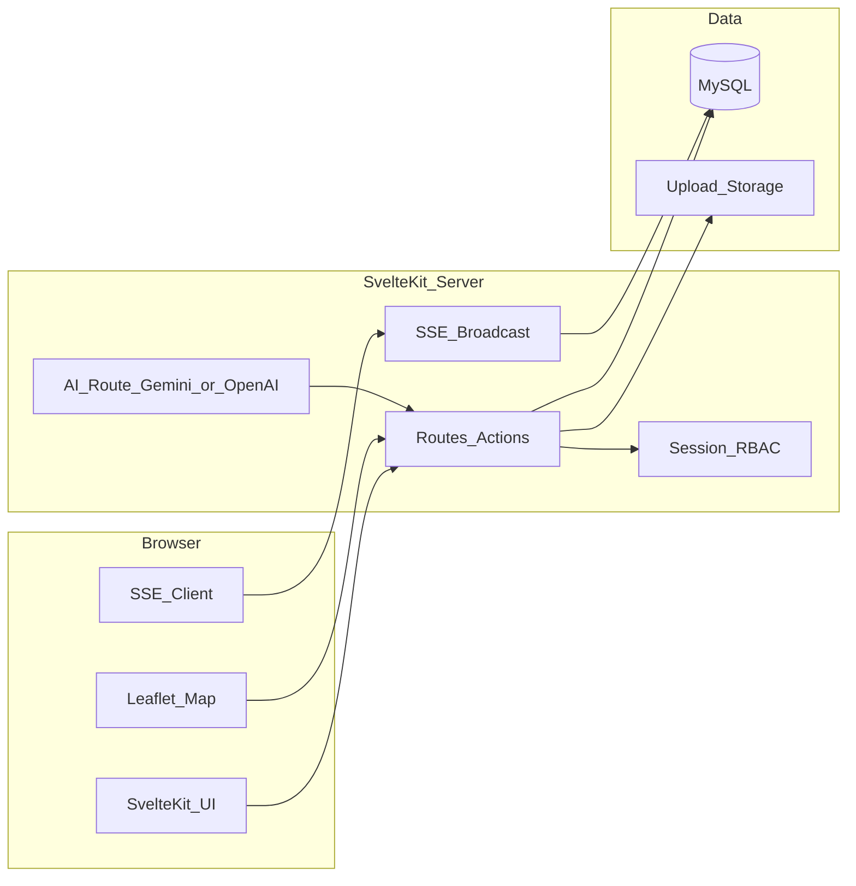

# Rencana implementasi OPS-SIS (total sesuai Master-PRD)

## Konteks

- Repositori saat ini **hanya** berisi [Master-PRD.md](Master-PRD.md); tidak ada kode. Semua fitur §2–§7 harus diimplementasikan sebagai proyek baru.
- **AI:** Anda memilih **keduanya bisa** — satu aktif lewat variabel lingkungan (mis. `AI_PROVIDER=openai|gemini` + key masing-masing).
- **Skill UI terdaftar:** [figma-implement-design](file:///Users/ralphwaworuntu/.cursor/plugins/cache/cursor-public/figma/9680714bad40503ef37a9f815fd1d2cd15150af4/skills/figma-implement-design/SKILL.md) membutuhkan **URL/node Figma**; karena tidak ada desain Figma di PRD, implementasi visual mengikuti identitas §7 (warna, tipografi, shadcn-svelte). Jika nanti Anda berikan link Figma, alur skill tersebut dipakai untuk menyelaraskan layar tertentu.
- **Context7 (`plugin-context7-plugin-context7`):** Dipakai saat implementasi untuk memverifikasi API terkini: SvelteKit (routing, server load, form actions), shadcn-svelte (instalasi komponen), Drizzle/MySQL, Leaflet di Svelte, SSE pattern di SvelteKit.
- **Magic MCP (`user-Magic MCP`):** Dipakai untuk **inspirasi dan penyempurnaan UI** (`21st_magic_component_inspiration`, `21st_magic_component_builder`, `21st_magic_component_refiner`) — output umumnya berorientasi React; **wajib di-port** ke Svelte + komponen shadcn-svelte + token PRD, bukan ditempel mentah.
- **Kualitas “no error”:** Setelah scaffold, target wajib `npm run check` (svelte-check), `npm run lint` (jika diaktifkan), dan `npm run build` lulus tanpa error.

## Arsitektur target



- **Penyimpanan file:** Antarmuka abstrak (mis. folder lokal `uploads/` untuk dev) dengan konfigurasi opsional S3-compatible (PRD menyebut S3) agar produksi bisa dialihkan tanpa mengubah domain aplikasi.
- **Real-time:** Endpoint SSE (mis. `GET /api/events/rengiat`) + **in-memory** `EventEmitter`/channel pada satu proses Node; dokumentasikan bahwa skala horizontal membutuhkan Redis/pub-sub (di luar MVP kecuali Anda minta).

## Stack & konvensi (dari PRD §7)

- SvelteKit + TypeScript + Tailwind.
- **shadcn-svelte** untuk komponen UI; tema diset ke **primary `#1E3A8A`**, **accent `#D4AF37`**, background `#FFFFFF`.
- Font: **Geist** (sans) dan **JetBrains Mono** (mono) via `app.html` / CSS — sesuai PRD (PRD menulis “Geist Mono” untuk Sans; akan diterapkan sebagai **Geist untuk body UI** dan **JetBrains Mono** untuk data monospace agar konsisten dan terbaca).
- Peta: **Leaflet** + tile OSM; komponen peta responsif (tinggi adaptif mobile, panel samping atau drawer di desktop).

## Skema data (PRD §6, diperinci)

- `users`: id, email/login unik, password hash, nama, pangkat, `role` (`POLSEK` | `POLRES` | `POLDA` | `KABO`), `unit_id` (FK opsional ke `units`).
- `units`: id, nama, tipe (POLSEK/POLRES/POLDA), parent_id (hierarki sederhana).
- `vulnerability_points`: id, lat, lng, jenis_kejahatan, frekuensi, `polres_id` (FK unit POLRES), timestamps.
- `rengiat`: id, judul, deskripsi/draf, `file_path` (dokumen), status (`Draft` | `PendingReview` | `PendingKabo` | `Approved` | `Rejected`), `ai_analysis` (JSON/teks), `final_plan` (teks), `created_by`, timestamps.
- `activity_reports`: id, `rengiat_id`, `user_id`, `foto_url`/`file_path`, deskripsi, timestamp.

## RBAC (matriks fitur)

| Fitur | POLSEK | POLRES | POLDA | KABO |
|--------|--------|--------|-------|------|
| Peta rawan (CRUD titik) | Baca | Tulis (wilayahnya) | Baca global | Baca |
| Upload / kelola Rengiat | — | Ya | Review | ACC final |
| AI auditor pada draf | — | Trigger + lihat hasil | Trigger + lihat | Lihat |
| AI generator alternatif | — | — | Ya | Opsional lihat |
| Lapor giat + foto | Ya (untuk Rengiat approved) | — | — | — |
| SSE notifikasi | Semua peran yang login | idem | idem | idem |

Implementasi: helper `assertRole` di server actions + layout/nav dinamis.

## Alur utama (implementasi)

1. **Bootstrap proyek:** `create-svelte` / SvelteKit terbaru, Tailwind, path alias, adapter Node (atau default sesuai docs Context7).
2. **MySQL + ORM:** Drizzle + `drizzle-kit` migrate; skema di atas; **seed** satu set user per peran.
3. **Auth:** Session cookie (mis. lucia atau implementasi session minimal dengan cookie HttpOnly) + bcrypt; halaman login.
4. **Dashboard per peran:** ringkasan status Rengiat, shortcut ke peta / unggah / approval / laporan.
5. **Modul peta:** halaman dengan Leaflet; form tambah titik (POLRES); daftar titik filter per unit.
6. **Modul Rengiat:** unggah file (validasi tipe/ukuran); simpan status Draft → submit ke alur; tombol dengan **optimistic UI** (PRD §7) + rollback jika action gagal.
7. **AI:** route server yang membaca `AI_PROVIDER`; memanggil OpenAI atau Gemini; menyimpan `ai_analysis` pada record; **generator** untuk usulan taktis (POLDA) menulis ke field terpisah atau `final_plan` draft.
8. **Workflow:** transisi status sesuai peran; setelah ACC KABO, broadcast SSE ke klien terkait (minimal: semua user terhubung mendapat event; filter di klien by role/unit jika perlu).
9. **Laporan giat:** POLSEK hanya untuk `rengiat` `Approved`; kompresi gambar di klien (library ringan) sebelum upload.
10. **Responsif:** mobile-first (nav hamburger / bottom bar ringkas, touch target ≥44px, peta full-width); desktop: sidebar + grid lebar, kartu dan tabel dengan `md:`/`lg:` breakpoints.

## File kredensial (permintaan Anda)

- Satu file mis. [`demo-credentials.md`](demo-credentials.md) (atau nama tetap yang Anda inginkan) berisi **tabel username / password / peran** untuk lingkungan pengembangan, dengan peringatan jelas **hanya untuk dev** dan **jangan dipakai produksi**.
- Password seed di-hash di DB; file tersebut mencerminkan **plain text demo** agar tester bisa login — disarankan menambahkan `demo-credentials.md` ke **`.gitignore`** jika repositori publik, atau hanya menyimpan contoh di repo dan menyalin ke file lokal (trade-off akan dijelaskan di komentar file).

## Perbaikan dokumen PRD (opsional, tidak mengubah makna)

- [Master-PRD.md](Master-PRD.md) §4: blok mermaid `graph TD` tidak ditutup dengan fence ``` — saat eksekusi bisa diperbaiki agar diagram render di GitHub/viewer.

## Risiko & mitigasi

- **Magic MCP → React:** hanya sebagai referensi visual/pola; implementasi final Svelte + shadcn.
- **SSE multi-instance:** dokumentasi batasan; MVP single server.
- **S3:** abstraksi storage agar PRD terpenuhi tanpa memaksa bucket saat dev.

## Urutan verifikasi akhir

1. `npm run check` + `npm run build`.
2. Smoke manual: login tiap peran dari file kredensial, alur submit → review → ACC → laporan + foto.
3. Uji lebar viewport mobile (375px) dan desktop (1280px+).
